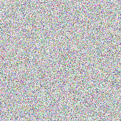

### introduction
This project so far contains a commandline tool that compresses and encodes a set of files as a PNG image. The goal is to find a way to encode encrypted data that's not detectable as such using algorithms, as well as convenient to distribute. I have chosen to delay the effort of implementing a decoder, as well as adding the encryption layer, until I feel reasonably confident about the chosen approach.

### motivation
I've been thinking about encrypted communications for a long time. Not because I have anything to hide, more because I'm a hacker at heart and like to mess with the systems designed to control us. At one point I wrote a messenger that used regular email accounts as dumb channels to send opaque blobs of encrypted data. While that worked well enough, two things kept bothering me.

* There is really no need for the software to dictate transport method. It's perfectly possible to build a messenger that simply spits out encoded data for distribution using whatever means that may then be consumed by the receiver.

* There are several problems with advertising the fact that a piece of data is encrypted. All encryption algorithms are potentially compromised and since so few are using them it's an obvious target for flagging accounts and individuals.

### usage
The code is written in [gfoo](https://github.com/codr7/gfoo) which needs to be installed to run it. Any number of input files may be specified, the resulting PNG image is written to standard output. The files are zipped before being encoded to reduce size and preserve file names.

```
$ gfoo enojs.gf alice.txt > alice.png
```

### examples
Two examples are included in the repository, the complete texts of [Alice's Adventures in Wonderland](https://github.com/codr7/nojs/blob/master/alice.txt) by Lewis Carroll and [The Adventures of Sherlock Holmes](https://github.com/codr7/nojs/blob/master/sherlock.txt) by Arthur Conan Doyle.

alice.png<br/>


sherlock.png<br/>
